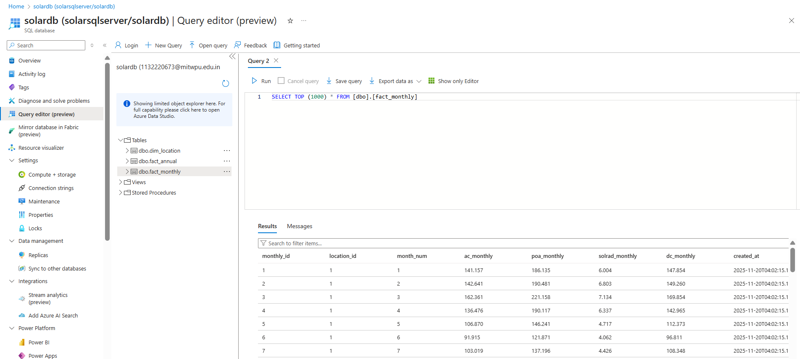
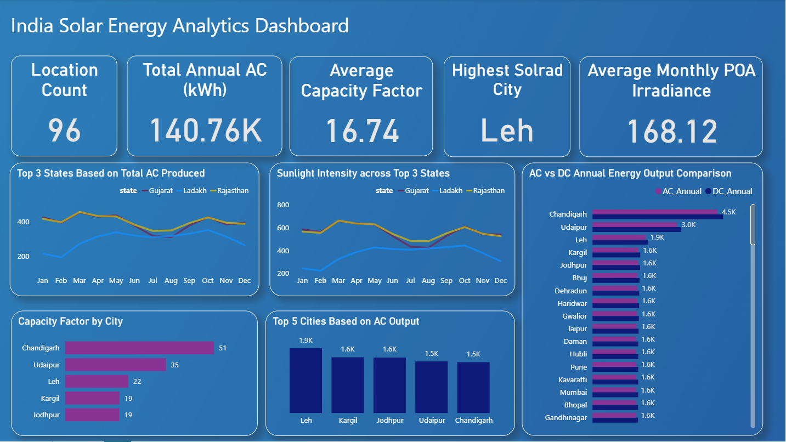

# Solar Energy Data Engineering Pipeline — India Analytics Dashboard

 **API → Azure Blob Storage → Azure Data Factory → Azure SQL Database → Power BI Dashboard**

This project builds a fully automated **end-to-end Solar Energy Analytics system** for 96 locations across India.  
It collects **both monthly and annual solar data** from an external API, including metrics such as **AC output, DC output, Solar Irradiance (Solrad), POA Irradiance, and Capacity Factor**.  
The data is processed through Azure Data Factory, stored in Azure SQL Database, and visualized using a Power BI dashboard for advanced analytics and decision-making.

## Project Overview

India has diverse solar potential across different regions, but actionable insights require collecting and analyzing solar performance data at scale.  
This project automates the complete lifecycle of solar data processing — from extraction to analytics — enabling energy planners, analysts, and researchers to evaluate solar performance by **state, city, and month**.

The pipeline:
- Retrieves **monthly and annual solar production data** via API for 96 geographic locations across India
- Extracts key metrics including **AC Energy, DC Energy, Solar Irradiance (Solrad), POA Irradiance, and Capacity Factor**
- Stores raw JSON files in **Azure Blob Storage**
- Performs ETL using **Azure Data Factory**
- Loads modeled data into **Azure SQL Database**
- Powers a **Power BI dashboard** to analyze solar trends, capacity potential, and regional performance

The final dashboard provides KPI summaries, trends over months, state-wise performance, and city-level comparisons to drive meaningful solar investment decisions.

## Problem Statement — Why This Project?

Solar output in India varies significantly across locations due to climatic and geographical differences.  
While high-quality solar datasets exist, they are usually **raw and not directly suitable for analytical decision-making**. The data contains multiple technical attributes such as **AC energy, DC energy, Solar Irradiance (Solrad), POA Irradiance, and Capacity Factor**, which require processing before they can support insights.

This project addresses that need by:
- Collecting detailed solar performance data for 96 cities across India via API
- Structuring it into analytical models using Azure services
- Building a dashboard to compare **solar potential by state, city, and month**

The solution demonstrates how raw solar datasets can be transformed into **actionable analytics** for energy planning, investment decisions, and geographical performance evaluation.

## Technologies Used & Implementation Workflow

This project integrates multiple cloud and analytics technologies to convert raw solar data into meaningful insights.

#### Workflow Overview
Python Script → Azure Blob Storage → Azure Data Factory (ETL) → Azure SQL Database → Power BI Dashboard

---

####  Python — API Data Extraction to Cloud
The Python script fetches monthly and annual solar data for 96 locations and uploads the raw JSON responses to Azure Blob Storage.

#### Azure Blob Storage — Raw Data Layer
The extracted JSON files are stored in Blob Storage within folders categorized by state, forming the raw data zone in the pipeline.

  

#### Azure Data Factory — ETL Pipelines & Data Flows
Data Factory pipelines flatten and transform the raw JSON into structured tables while handling mapping, column transformations, and data types.

Dataflows:-

  

Pipeline Execution:-

  

#### Azure SQL Database — Data Storage for Dashboard
Transformed data is loaded into Azure SQL Database, where tables are structured for easy consumption by Power BI.

  

#### Power BI — Final Solar Analytics Dashboard
The Power BI report visualizes solar performance by state, city, and month with KPIs, trends, top-performing regions, and correlation insights.

  

### Insights from the Dashboard
- Total annual AC output across all locations is **~140.76K kWh**.
- **Leh recorded the highest annual solar radiation (SOLRAD)** among all cities.
- **Top-performing states:** Gujarat, Ladakh, and Rajasthan — leading in AC output across months.
- **Seasonal trend:** Peak sunlight intensity from **March to May**, with dips during monsoon and winter.
- **Chandigarh & Udaipur** show the highest **AC vs DC annual performance**, with Chandigarh reaching **~4.5K AC annually**.
- **Capacity Factor varies significantly** — Chandigarh ranks highest (51), while Leh, Kargil, and Jodhpur show moderate factors.
- **Top 5 cities based on AC output:** **Leh → Kargil → Jodhpur → Udaipur → Chandigarh**

### Interpretation
- Cities with **high solar radiation + strong capacity factor** yield the best ROI for solar installations.
- Solar performance follows **predictable seasonal patterns**, enabling accurate forecasting for grid and demand planning.
- The analysis highlights **ideal zones for commercial vs. residential solar deployment** across India.

---
